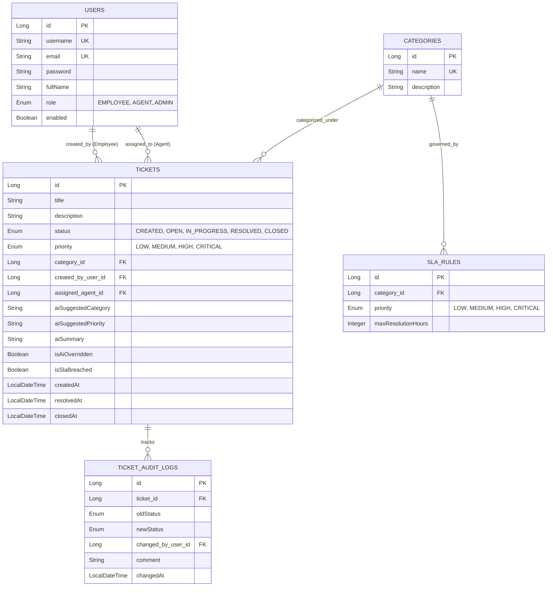

# Smart IT Helpdesk System with Gen AI Triage & PL/SQL SLA Engine

A portfolio-grade, production-ready RESTful backend system built with **Java 17 / Spring Boot 3.x**, featuring **Spring Security JWT authentication**, **Asynchronous Gen AI Ticket Triage**, and **MySQL PL/SQL Stored Procedures** for SLA breach detection and executive reporting.

Designed specifically for **Cognizant GenC Next (Java/Spring Stream)** technical interview defense.

---

## 🌟 Tech Stack

| Domain | Technology / Library |
| :--- | :--- |
| **Core Framework** | Java 17+, Spring Boot 3.2.x |
| **Web & REST** | Spring Web (REST APIs), Spring Validation (`@Valid`) |
| **Security & Auth** | Spring Security 6.x, JWT (`jjwt` 0.12.x), BCrypt Password Hashing |
| **Persistence** | Spring Data JPA, Hibernate ORM, MySQL / H2 Database |
| **Database Logic** | PL/SQL Stored Procedures (`sp_check_sla_breaches`, `sp_get_helpdesk_metrics`) |
| **Gen AI Triage** | Google Gemini API (or customizable LLM REST API) via Spring `@Async` |
| **Job Scheduling** | Spring `@Scheduled` Cron Engine |
| **API Documentation**| SpringDoc OpenAPI 2.x (Swagger UI) |
| **Testing** | JUnit 5, Mockito, Spring MockMvc |

---

## 🏗️ Architecture & Entity Relationship Model



---

## 📁 Package Structure

```text
com.helpdesk.sys
├── SmartItHelpdeskApplication.java
├── config/             # Security, Async Thread Pool, Swagger OpenAPI
├── controller/         # REST Controllers (Auth, Tickets, Categories, SLA, Reports)
├── dto/                # Request & Response DTOs (No entities exposed)
│   ├── request/
│   └── response/
├── entity/             # JPA Entities (User, Ticket, Category, SlaRule, TicketAuditLog, Enums)
├── exception/          # Custom exceptions & @ControllerAdvice GlobalExceptionHandler
├── repository/         # Spring Data JPA Repositories + Native Query Stored Procedure calls
├── security/           # JWT Token Provider, CustomUserDetailsService, JwtAuthFilter
└── service/            # Business logic interfaces & implementations (@Async AI, SLA Scheduler, Reports)
    └── impl/
```

---

## ⚙️ Quick Local Setup

### 1. Prerequisites
- Java 17 or Java 21 JDK installed
- Maven 3.8+ installed
- MySQL Server 8.0+ (Optional: H2 in-memory DB is preconfigured by default for instant local execution)

### 2. Environment Variables Setup
Copy `.env.example` to `.env` or set environment properties in `application.yml`:

```env
SPRING_DATASOURCE_URL=jdbc:mysql://localhost:3306/helpdesk_db?useSSL=false&allowPublicKeyRetrieval=true&serverTimezone=UTC
SPRING_DATASOURCE_USERNAME=root
SPRING_DATASOURCE_PASSWORD=your_password
JWT_SECRET=9a4f2c8d7e1b5a3c6d8e0f2a4b6c8d1e3f5a7b9c0d2e4f6a8b1c3d5e7f9a0b2c
GEMINI_API_KEY=your_gemini_api_key_here
```

### 3. Run Application
```bash
mvn clean spring-boot:run
```

### 4. Access Swagger UI API Documentation
Open your browser and navigate to:
[http://localhost:8080/swagger-ui.html](http://localhost:8080/swagger-ui.html)

---

## 🔑 Pre-seeded Test Users

All seeded users have default password: **`Password@123`**

| Role | Username | Email | Permissions |
| :--- | :--- | :--- | :--- |
| **ADMIN** | `admin` | `admin@helpdesk.com` | Full system access, Manage SLA Rules, Trigger Stored Procedures, View Reports |
| **AGENT** | `agent_john` | `john.agent@helpdesk.com` | View all tickets, update status (`OPEN` $\rightarrow$ `RESOLVED`), override AI triage |
| **EMPLOYEE** | `emp_alice` | `alice.emp@company.com` | Raise tickets, view personal ticket status history |

---

## 🧠 Key Technical Concepts & Architectural Highlights

### 1. Why DTOs (Data Transfer Objects) instead of Entities?
- **Security**: Prevents exposing sensitive entity fields (like BCrypt password hashes or internal foreign keys).
- **API Stability**: Prevents database schema refactoring from breaking frontend JSON API contracts.
- **Prevent JSON Recursion**: Avoids infinite Jackson serialization loops caused by bi-directional JPA `@ManyToOne` / `@OneToMany` relationships.

### 2. Constructor Injection vs `@Autowired` Field Injection
- **Immutability**: Dependencies are declared `final`.
- **Testability**: Standard JUnit unit tests can instantiate services directly with `new TicketServiceImpl(...)` without initializing a heavy Spring ApplicationContext or Reflection.
- **Compile-Time Verification**: Prevents runtime `NullPointerException` by catching missing bean dependencies at startup.

### 3. Asynchronous Gen AI Ticket Triage (`@Async`)
- **Non-blocking Ticket Creation**: Calling LLM REST APIs takes 1-3 seconds. Using `@Async("aiTaskExecutor")` offloads the LLM request to a separate worker thread pool (`ThreadPoolTaskExecutor`), allowing the HTTP POST response to return immediately to the user with `201 Created`.
- **Fault-Tolerant Fallback**: If the Gemini API key is missing or encounters rate limits, an intelligent heuristic rule-based triage classifier handles category/priority suggestions so ticket creation never fails.

### 4. PL/SQL Stored Procedures for Business Logic
- **`sp_check_sla_breaches`**: Runs automatically every 15 minutes via `@Scheduled` Spring Cron (`0 */15 * * * *`). It performs batch timestamp arithmetic directly inside MySQL engine to flag breached tickets where elapsed age exceeds `SLA_RULES.max_resolution_hours`.
- **`sp_get_helpdesk_metrics`**: Executes aggregated database statistics query in a single database round-trip for executive dashboard reporting.

---

## 🚀 Azure & AWS Cloud Deployment Guide

### Option A: Azure App Service (Linux / Java 17) + Azure Database for MySQL
1. **Create Azure MySQL Flexible Server**:
   - Provision Azure Database for MySQL in Azure Portal.
   - Run `schema.sql`, `stored_procedures.sql`, and `data.sql`.
2. **Build Runnable JAR**:
   ```bash
   mvn clean package -DskipTests
   ```
3. **Deploy via Azure CLI**:
   ```bash
   az webapp up --resource-group helpdesk-rg --name smart-it-helpdesk-app --runtime "JAVA:17-java17"
   ```
4. **Set Environment Variables in Azure Portal**:
   Navigate to **App Service Configuration** $\rightarrow$ **Application Settings** and add `SPRING_DATASOURCE_URL`, `SPRING_DATASOURCE_USERNAME`, `SPRING_DATASOURCE_PASSWORD`, and `JWT_SECRET`.

### Option B: AWS Elastic Beanstalk (Java Core Platform) + AWS RDS MySQL
1. **Provision RDS MySQL Instance**: Create a MySQL DB instance in AWS RDS inside VPC.
2. **Create Elastic Beanstalk Application**:
   - Platform: Java 17 / Corretto.
   - Upload target JAR: `target/smart-it-helpdesk-1.0.0.jar`.
3. **Configure Environment Properties**:
   In Elastic Beanstalk Console $\rightarrow$ **Configuration** $\rightarrow$ **Software**, set database credentials and `JWT_SECRET`.

---

## 🧪 Running Unit & Integration Tests

```bash
mvn test
```

Includes:
- **`TicketServiceTest.java`**: JUnit 5 + Mockito unit tests for ticket creation lifecycle, status transition validation, and async AI trigger verification.
- **`TicketControllerTest.java`**: Spring `MockMvc` integration tests for HTTP endpoint validation.
